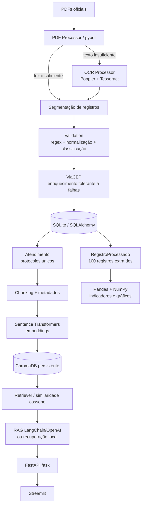

# Documentação técnica — arquitetura

## Componentes

- **config.py**: carrega `.env`/`config.json`, valida parâmetros e resolve caminhos relativos.
- **pdf_processor.py**: lê páginas e decide extração direta versus OCR.
- **ocr_processor.py**: verifica Tesseract/Poppler e rasteriza/processa páginas digitalizadas.
- **validation.py**: segmenta atendimentos, extrai campos, normaliza e classifica.
- **cep_client.py**: enriquece CEP sem transformar indisponibilidade externa em falha do pipeline.
- **models.py/database.py**: persistência SQLAlchemy, transações e CRUD controlado.
- **RegistroProcessado**: histórico de todos os registros, inclusive duplicados; permite reconstrução idempotente dos outputs.
- **Atendimento**: cadastro persistido com protocolo único usado pelos chunks e busca.
- **analytics.py**: indicadores obrigatórios, CSV/JSON e gráficos PNG.
- **text_processor.py**: NLP e chunking configurável.
- **embeddings.py/indexer.py/vector_store.py**: embeddings, sincronização e consulta ChromaDB.
- **rag.py**: contexto rastreável, resposta fundamentada e fallback local.
- **api.py/ui_client.py/app_streamlit.py**: serviço HTTP e interface.

## Decisões arquiteturais

1. **Separar histórico bruto de entidade única** evita perder duplicados dos indicadores e mantém a unicidade do protocolo no banco.
2. **Documento possui estado `concluido`**: falhas parciais não tornam o hash permanentemente “processado”; uma próxima execução pode repetir o documento.
3. **Outputs são reconstruídos do banco**, não apenas da lista processada na execução atual. Isso torna a execução idempotente.
4. **Erros de um documento/página não encerram o lote**; são persistidos e logados.
5. **Serviços externos são opcionais/tolerantes a falha**: ViaCEP e OpenAI não impedem o processamento local.
